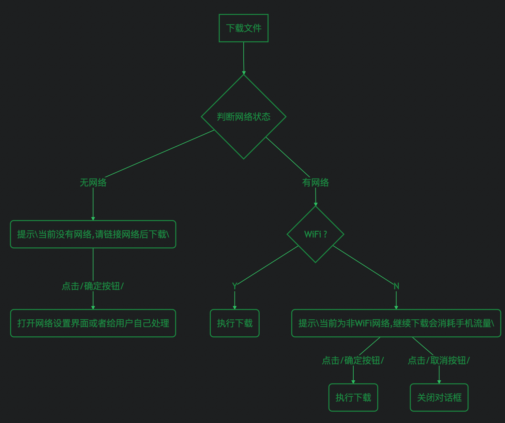

#### 概述

做业务需求的时候，经常遇到根据当前网络状态提示引导用户操作，如下载文件等。其实完全可以把这个逻辑封装起来，不用每次都得梳理下逻辑和重复的代码。下面是流程图：



##### 代码


```
/**
 * @author bruce.zhang
 * @date 2019/3/7 16:06
 * @description 网络状态监测执行逻辑
 * <p>
 * modification history:
 */
public class NetStateChecker {

    public interface NetStateCheckCallback {

        /**
         * 有网络时继续执行
         */
        void onContinue();

        /**
         * 没有网络回调 返回false 自动进入网络设置界面
         */
        boolean onNoNet();

        /**
         * 取消
         */
        void onCancel();
    }

    String titleRes;

    String notWiFiMsgRes;

    String noNetMsgRes;

    NetStateCheckCallback netStateCheckCallback;


    private NetStateChecker() {

    }

    public static NetStateChecker newInstance() {
        return new NetStateChecker();
    }

    public NetStateChecker setTitleRes(String titleRes) {
        this.titleRes = titleRes;
        return this;
    }

    public NetStateChecker setNotWiFiMsgRes(String notWiFiMsgRes) {
        this.notWiFiMsgRes = notWiFiMsgRes;
        return this;
    }

    public NetStateChecker setNoNetMsgRes(String noNetMsgRes) {
        this.noNetMsgRes = noNetMsgRes;
        return this;
    }

    public NetStateChecker setNetStateCheckCallback(NetStateCheckCallback netStateCheckCallback) {
        this.netStateCheckCallback = netStateCheckCallback;
        return this;
    }

    public void check(final KidBaseActivity context) {
        if(TextUtils.isEmpty(titleRes) || TextUtils.isEmpty(notWiFiMsgRes) || TextUtils.isEmpty(noNetMsgRes)) {
            throw new IllegalArgumentException("titleRes, notWiFiMsgRes, noNetMsgRes不能为空");
        }

        if(netStateCheckCallback == null) {
            throw new IllegalArgumentException("netStateCheckCallback不能为null");
        }

        if(DeviceUtils.isAvailable(context)) {
            // 移动网络
            if(!DeviceUtils.isWifi(context)) {
                BaseConfirmDialog.getInstance(titleRes,
                        notWiFiMsgRes,
                        true,
                        new IBaseConfirmDialogListener() {
                            @Override
                            public void onCancel() {
                                netStateCheckCallback.onCancel();
                            }

                            @Override
                            public void onConfirm() {
                                netStateCheckCallback.onContinue();
                            }
                        })
                        .show(((KidBaseActivity)context).getSupportFragmentManager(), null);
            } else {
                netStateCheckCallback.onContinue();
            }
        } else {
            BaseConfirmDialog.getInstance(titleRes,
                    noNetMsgRes,
                    true,
                    new IBaseConfirmDialogListener() {
                        @Override
                        public void onCancel() {

                        }

                        @Override
                        public void onConfirm() {
                            if(!netStateCheckCallback.onNoNet()) {
                                context.startActivity(new Intent(Settings.ACTION_WIRELESS_SETTINGS));
                            }
                        }
                    })
                    .isVisibleCancel(false)
                    .show(context.getSupportFragmentManager(), null);
        }
    }
}
```

##### 调用方式
```
 NetStateChecker.newInstance()
                        .setTitleRes(context.getString(R.string.material_download_net_hint))
                    .setNotWiFiMsgRes(context.getString(R.string.material_download_net_hint_msg))
                    .setNoNetMsgRes(context.getString(R.string.material_download_net_no))
                    .setNetStateCheckCallback(new NetStateChecker.NetStateCheckCallback() {
                        @Override
                        public void onContinue() {
                            startShare((KidBaseActivity)context, shareSimple);
                        }

                        @Override
                        public boolean onNoNet() {
                            return false;
                        }

                        @Override
                        public void onCancel() {

                        }
                    })
                    .check((KidBaseActivity)context);
```

