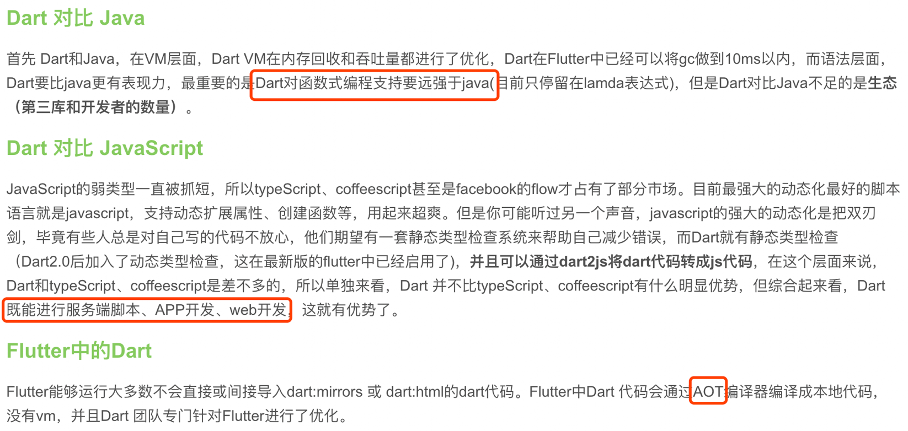

## 参考文章

1. [Flutter中文网](https://flutterchina.club/)
2. [flutter-io.cn](https://flutter-io.cn/)
3. [Flutter Github源码](https://github.com/flutter/flutter/tree/stable)
4. [Flutter原理与实践-美团](https://tech.meituan.com/waimai_flutter_practice.html)
5. [Stack Overflow来处理“HOWTO”类型的问题](https://stackoverflow.com/tags/flutter)
6. [Android各种场景如何在Flutter中处理](https://flutterchina.club/flutter-for-android/)
7. [阿里出品的各种widget演示](https://github.com/alibaba/flutter-go)

## 注意点

1. 进入flutter目录，执行flutter doctor命令找不到命令错误，需要先设置全局环境变量才行。
2. Dart是单线程执行模型，支持Isolates（在另一个线程上运行Dart代码的方式）、事件循环和异步编程。 除非您启动一个Isolate，否则您的Dart代码将在主UI线程中运行，并由事件循环驱动（译者语：和JavaScript一样）。
3. Dart SDK已经在捆绑在Flutter里了，没有必要单独安装Dart。 flutter/bin/cache/dart-sdk
4. 第一次运行一个flutter命令（如flutter doctor）时，它会下载它自己的依赖项并自行编译。以后再运行就会快得多。

## 安装
怎样使用IDE看这里：https://flutterchina.club/using-ide/

1. 去github上clone稳定版本flutter
2. 设置全局环境变量到fluter/bin目录
```
export PUB_HOSTED_URL=https://pub.flutter-io.cn
export FLUTTER_STORAGE_BASE_URL=https://storage.flutter-io.cn
export PATH=$PATH:~/android/flutter/bin
```
3. 运行 flutter doctor 命令，该命令检查您的环境并在终端窗口中显示报告，如是否安装Android SDK等
4. 运行 flutter devices 命令以验证Flutter识别您连接的Android设备
5. flutter create myapp命令创建一个最简单的flutter程序
6. 在项目根目录下运行 flutter run 命令来运行应用程序
7. 用android studio开发需要安装Flutter插件和Dart插件，File-New Flutter Project或者File Open打开已存在的flutter工程
8. 在flutter工程中右击android目录-flutter-open android module in android studio可以在新的窗口中打开android部分代码

## 常用flutter命令
通过flutter help可以查看有哪些命令
1. flutter channel 查看flutter当前使用的分支master还是stable
2. 要切换分支，请使用flutter channel beta 或 flutter channel master
3. [升级 Flutter相关命令](https://flutterchina.club/upgrading/)

## flutter框架开发语言
Google 把 Flutter 作为 Fuchsia 的用户界面，Dart 作为主要的编程语言，从颜色和展示效果上看，使用的是 Material Design UI 理念。


## [Flutter Widget框架概述](https://flutterchina.club/widgets-intro/)
1. Flutter Widget采用现代响应式框架构建，这是从 React 中获得的灵感，中心思想是用widget构建你的UI。
2. 框架强制根widget覆盖整个屏幕。
3. Flutter框架将依次构建这些widget，直到构建到最底层的子widget时，这些最低层的widget通常为RenderObject，它会计算并描述widget的几何形状。
4. 无状态的widget，它将通过构造函数从父widget中接收到的值存储在**final**成员变量中，然后在build函数中使用它们。

## 写UI的思路
1. 整理页面需要哪些widget以及他们的嵌套关系
2. 分析哪些widget需要把逻辑封装起来，widget一般不会继承，都是继承StatelessWidget或者StatefulWidget来组装各种基础widget。
3. 需要封装起来widget是有状态的还是无状态的，一般来说外层的widget保持状态，内部的widget不需要保持状态，需要的数据通过构造函数传进来，然后再通过事件告诉父widget，原则是事件流是“向上”传递的，而状态流是“向下”传递的。
4. 状态数据一般是保存在widget对应的State类中的变量上。
5. 最后是具体些widget的时候了，怎么写查文档或者google。


## flutter插件
在Flutter中，依赖包由[Pub](https://pub.dartlang.org/)仓库管理，项目依赖配置在项目根目录下pubspec.yaml文件中声明即可（类似于NPM的版本声明 Pub Versioning Philosophy），对于未发布在Pub仓库的插件可以使用git仓库地址或文件路径
```dependencies:
url_launcher: ">=0.1.2 <0.2.0"
collection: "^0.1.2"
plugin1:
    git:
    url: "git://github.com/flutter/plugin1.git"
plugin2:
    path: ../plugin2/
```
## 一切皆控件
在Flutter中，所有功能都可以通过组合多个Widget来实现，包括对齐方式、按行排列、按列排列、网格排列甚至事件处理等等。在Flutter中“一切皆是控件”，通过组合、嵌套不同类型的控件，就可以构建出任意功能、任意复杂度的界面


## [Android发布版本](https://flutterchina.club/android-release/)
默认情况下，flutter run命令会使用调试版本配置。
编译release包: flutter build apk
安装：flutter install
注意：这三个命令都要在项目根目录下执行

## Widget不可变特性理解
在Flutter中Widget是不可变的，不会直接更新，而必须使用Widget的状态才能更新。所以Widget仅支持一帧，并且在每一帧上，Flutter的框架都会创建一个Widget实例树(译者语：相当于一次性绘制整个界面)。
这里要注意的重要一点是无状态和有状态widget的核心特性是相同的，每一帧它们都会重新构建，不同之处在于StatefulWidget有一个State对象，它可以跨帧存储状态数据并恢复它。
所以Flutter中不存在添加或删除组件，您可以传入一个函数，该函数返回一个widget给父项，并通过布尔值控制该widget的创建，可以理解成重新动态创建。
```
body: new Center(
    child: _getToggleChild(),
)

_getToggleChild() {
    if (toggle) {
        return new Text('Toggle One');
    } else {
    return new MaterialButton(onPressed: () {}, child: new Text('Toggle Two'));
    }
}

```

## 扩展和自定义widget
Flutter拥抱组合：widget由较小的widget构建而成，您可以以各种方式组合，以制作自定义widget。例如，RaisedButton将一个Material widget与一个GestureDetector widget组合在一起，而不是对一个通用按钮widget进行子类化。Material widget提供了可视化设计，而GestureDetector widget提供了交互设计。

## “热重载”与“完全重新启动”有何不同？
Hot Reload通过将更新的源代码文件注入正在运行的Dart VM（虚拟机）中工作。这不仅包括添加新类，还包括向现有类添加方法和字段，以及更改现有函数。尽管有几种类型的代码更改无法热重新：
1. 全局变量初始化器。
2. 静态字段初始化程序。
3. main()应用程序的方法。

## 我可以在Flutter应用程序的后台运行Dart代码吗？
由于在Android和iOS平台上支持后台执行的基本差异，在后台运行代码具有特定于平台的API。
在Android上，android_alarm_manager 即使您的Flutter应用程序不在前台，该插件也可让您在后台运行Dart代码。
在iOS上，我们目前不支持此功能。请留意Bug 6192的更新。
## 动态更新ListView
1. [ListView的builder工厂构造函数允许您按需建立一个懒加载的列表视图，不需要调用setState方法也可以更新列表](https://flutterchina.club/get-started/codelab/)

```
Widget _buildSuggestions() {
    return new ListView.builder(
        // 该方法至少执行一次，哪怕列表是空的
        itemBuilder: (context, i) {
            final index = i ~/ 2;
            // 如果是建议列表中最后一个单词对
            if (index >= _suggestions.length) {
            // ...接着再生成10个单词对，然后添加到建议列表，不需要调用setState方法
            _suggestions.addAll(generateWordPairs().take(10));
        }
        return _buildRow(_suggestions[index]);
    }
    );
}

```
2. [不需要懒加载，直接new ListView，需要调用setState更新状态才能刷新列表](https://flutterchina.club/flutter-for-android/)

```
Widget getRow(int i) {
    return new GestureDetector(
        child: new Padding(
        padding: new EdgeInsets.all(10.0),
        child: new Text("Row $i")),
            onTap: () {
                // 必须调用setState
                setState(() {
                widgets = new List.from(widgets);
                widgets.add(getRow(widgets.length + 1));
                print('row $i');
            });
        },
    );
}
```

## [事件流是“向上”传递的，而状态流是“向下”传递的](https://flutterchina.club/widgets-intro/)
在Flutter中，事件流是“向上”传递的，而状态流是“向下”传递的（译者语：这类似于React/Vue中父子组件通信的方式：子widget到父widget是通过事件通信，而父到子是通过状态），重定向这一流程的共同父元素是State。更形象的理解是，父元素State是一个桥梁，子widget出发事件->State中的变量->更新其他Widget，这样可以达到*责任分离允许将复杂性逻辑封装在各个widget中，同时保持父项的简单性。*

## Scaffold
Scaffold 是 Material library 中提供的一个widget, 它提供了默认的导航栏、标题和包含主屏幕widget树的body属性